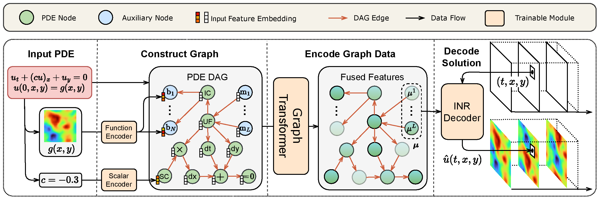
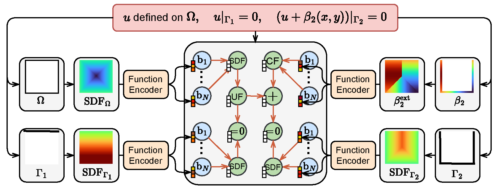

# PDEformer-2: A Foundation Model for Two-Dimensional PDEs

## Overview

Partial differential equations (PDEs) are closely related to numerous physical phenomena and engineering applications, covering multiple fields such as airfoil design, electromagnetic field simulation, and stress analysis.
In these practical applications, solving PDE often requires repeated iterations.
Although traditional PDE solving algorithms are highly accurate, they often consume a significant amount of computational resources and time.
The neural operator methods proposed in recent years, based on deep learning, have greatly improved the speed of solving PDEs.
However, they pose difficulties to generalize to new forms of PDE, and often encounter problems such as high training costs and limited data size.

We develop the PDEformer model series to address the above issues.
This is a class of end-to-end solution prediction models that can directly handle almost **any form of PDE**, eliminating the need for customized architecture design and training for different PDEs, thereby significantly reducing model deployment costs and improving solution efficiency.
The [PDEformer-1](https://gitee.com/mindspore/mindscience/blob/legacy-master/MindFlow/applications/pdeformer1d) model developed for one-dimensional PDEs has been open-sourced previously.
The current PDEformer-2 model for two-dimensional PDEs, pretrained on a dataset of **approximately 40TB**, can directly handle 2D PDEs with different **computational domains, boundary conditions, number of variables, and time dependencies**, and quickly obtain predicted solutions at **any spatio-temporal location**.
This has laid a promising foundation for the model to support research on numerous physical phenomena and engineering applications in fields such as fluids and electromagnetics.

## Methodology

We consider two-dimensional PDEs defined on $(t,r)\in[0,1]\times\Omega$ of the generic form

$$\mathcal{F}(u_1,u_2,\dots,c_1,c_2,\dots,s_1(r),s_2(r),\dots)=0\text{ in }\Omega,$$
$$\mathcal{B}_i(u_1,u_2,\dots,c_{i1},c_{i2},\dots,s_{i1}(r),s_{i2}(r),\dots)=0\text{ on }\Gamma_i,$$

where $r=(x,y)\in\Omega\subseteq[0,1]^2$ is the spatial coordinate, $c_1,c_2,\dots,c_{11},c_{12},\dots \in \mathbb{R}$ are real-valued coefficients, $s_1(r),s_2(r)\dots,s_{11}(r),\dots$ are scalar functions (which may serve as initial conditions, boundary values or coefficient fields in the equation), and $u_1,u_2,\dots:[0,1]\times\Omega\to\mathbb{R}$ are unknown field variables to be solved in the equation.
The boundary conditions are indexed by $i=1,2,\dots$.
Here, we assume that each of the operators $\mathcal{F},\mathcal{B}_1,\mathcal{B}_2,\dots$ admits a symbolic expression, which may involve differential and algebraic operations.
The goal of PDEformer-2 is to construct a surrogate model of the solution mapping
$$(\Omega,\mathcal{F},c_1,\dots,s_1(r),\dots,\Gamma_1,\mathcal{B}_1,c_{11},\dots,s_{11}(r),\dots)\mapsto(u_1,u_2,\dots),$$
The input of this solution mapping includes the location of the computational domain $\Omega$ and the boundaries $\Gamma_1,\Gamma_2,\dots$,
the symbolic expressions of the interior operator $\mathcal{F}$ and boundary operators $\mathcal{B}_1,\mathcal{B}_2,\dots$,
as well as the numeric information $c_1,\dots,c_{11},\dots,s_1(r),\dots,s_{11}(r),\dots$ involved,
and the output includes all components of the predicted solution, i.e., $u_1,u_2,\dots:[0,1]\times\Omega\to\mathbb{R}$.
Taking the (single component) advection equation $u_t+(cu)_x+u_y=0$, $u(0,r)=g(r)$ on $\Omega=[0,1]^2$ with periodic boundary conditions as an example:



As shown in the figure, PDEformer-2 first formulates the symbolic expression of the PDE as a computational graph, and makes use of a scalar encoder and a function encoder to embed the numeric information of the PDE into the node features of the computational graph.
Then, PDEformer-2 encodes this computational graph using a graph Transformer, and decodes the resulting latent vectors using an implicit neural representation (INR) to obtain the predicted values of each solution component of PDE at specific spatio-temporal coordinates.
A more detailed interpretation of the working principle of the model can be found in the introduction of [PDEformer-1](https://gitee.com/mindspore/mindscience/blob/legacy-master/MindFlow/applications/pdeformer1d).

In terms of the complex domain shapes and boundary locations that may appear in two-dimensional equations, PDEformer-2 represents them as signed distance functions (SDFs), and embeds this information into the computational graph using the function encoder.
The example shown in the following figure demonstrates the way of using computational graphs to represent Dirichlet boundary conditions on a square domain:



## Installation

Install the project dependencies, including PyTorch, with:

```bash
pip install -e .
```

This repository is scoped to inference, documentation, UI helpers, and visualization. Training, fine-tuning, pretraining, dataset preprocessing, and inverse-problem runners are intentionally omitted.

## Model Running

We provide configuration files for PDEformer models with different numbers of parameters in the [configs/inference](configs/inference) folder.
The details are as follows:

| Model | Parameters | Configuration File | Checkpoint File |
| ---- | ---- | ---- | ---- |
| PDEformer-2-base | 82.65M | [configs/inference/model-L.yaml](configs/inference/model-L.yaml) | `model-L.pt` PyTorch state dict |
| PDEformer-2-fast | 71.07M | [configs/inference/model-M.yaml](configs/inference/model-M.yaml) | `model-M.pt` PyTorch state dict |
| PDEformer-2-small | 27.75M | [configs/inference/model-S.yaml](configs/inference/model-S.yaml) | `model-S.pt` PyTorch state dict |

The model factory now loads PyTorch checkpoints with `torch.load` and `load_state_dict`.
Set `model.load_ckpt` to a PyTorch `state_dict` file, or to `none` to instantiate the model without weights.
Native MindSpore `.ckpt` files need to be converted before they can be loaded by this PyTorch build.

PDEformer-2-small (i.e., the S model) is only provided for users requiring faster inference.
We have not evaluate its performance systematically.

### Inference Example

The example code below demonstrates how to use PDEformer-2 to predict the solution of a given PDE,
taking the nonlinear conservation law $u_{t}+(u^2)_x+(-0.3u)_y=0$ (with periodic boundary conditions) as the example.
Before running with pretrained weights, convert the original PDEformer-2-fast release weights to a PyTorch state dict and change the value of the `model.load_ckpt` entry in [configs/inference/model-M.yaml](configs/inference/model-M.yaml) to the path of the corresponding `.pt` file.

```python
import numpy as np
from src import load_config, get_model, PDENodesCollector
from src.inference import infer_plot_2d, x_fenc, y_fenc

# Basic Settings
config = load_config("configs/inference/model-M.yaml")
model = get_model(config)

# Specify the PDE to be solved
pde = PDENodesCollector()
u = pde.new_uf()
u_ic = np.sin(2 * np.pi * x_fenc) * np.cos(4 * np.pi * y_fenc)
pde.set_ic(u, u_ic, x=x_fenc, y=y_fenc)
pde.sum_eq0(pde.dt(u), pde.dx(pde.square(u)), pde.dy(-0.3 * u))

# Predict the solution using PDEformer (with spatial resolution 32) and plot
pde_dag = pde.gen_dag(config)
x_plot, y_plot = np.meshgrid(np.linspace(0, 1, 32), np.linspace(0, 1, 32), indexing="ij")
u_pred = infer_plot_2d(model, pde_dag, x_plot, y_plot)
```

For more examples, please refer to the interactive notebook [PDEformer_inference.ipynb](PDEformer_inference.ipynb).

## File Directory

```text
./
│  PDEformer_inference.ipynb                     # English interactive notebook for inference examples
│  pyproject.toml                                # Python dependency list and project metadata
│  README.md                                     # English documentation
├─configs
│  └─inference                                   # Configurations for loading pretrained PDEformer models
│         model-L.yaml                           # Size-L model configuration
│         model-M.yaml                           # Size-M model configuration
│         model-S.yaml                           # Size-S model configuration
├─docs
│  │  FILE_TREE.md                               # This file
│  └─images                                      # Images used in README and notebooks
├─scripts
│      run_ui.sh                                 # Start the GUI demonstration
└─src
    │  inference.py                              # PDEformer inference helpers
    ├─cell                                       # PDEformer model architecture
    │  │  basic_block.py                         # Shared neural-network blocks
    │  │  env.py                                 # Model constants and switches
    │  │  wrapper.py                             # PDEformer model factory and checkpoint loading
    │  └─pdeformer
    │      │  function_encoder.py                # Function encoder module
    │      │  pdeformer.py                       # PDEformer network architecture
    │      ├─graphormer                          # Graphormer encoder modules
    │      └─inr_with_hypernet                   # INR + HyperNet modules
    ├─data
    │  │   env.py                                # DAG constants and data precision settings
    │  │   pde_dag.py                            # PDE-to-DAG construction and graph tensor generation
    │  └─multi_pde                               # PDE term and boundary builders used by the UI
    │         boundary.py                        # Legacy boundary helper required by boundary v2
    │         boundary_v2.py                     # Boundary-condition DAG helpers
    │         boundary_v2_from_dict.py           # Dictionary interface for UI boundary terms
    │         terms.py                           # PDE term DAG and LaTeX helpers
    │         terms_from_dict.py                 # Dictionary interface for UI PDE terms
    ├─ui                                         # GUI utilities
    │      basic.py                              # UI base classes
    │      database.py                           # PDE term database components
    │      dcr.py                                # DCR equation GUI demo
    │      elements.py                           # UI elements
    │      pde_types.py                          # UI PDE solver wrappers
    │      utils.py                              # UI plotting and expression helpers
    │      widgets.py                            # UI widgets for PDE terms
    └─utils                                      # Inference and visualization utilities
           load_yaml.py                          # YAML configuration loader
           tools.py                              # Miscellaneous helper functions
           visual.py                             # Plotting and animation helpers
```

## Citation

If you find this work helpful for you, please kindly consider citing our paper:

```bibtex
@misc{pdeformer2,
      title={PDEformer-2: A Versatile Foundation Model for Two-Dimensional Partial Differential Equations},
      author={Zhanhong Ye and Zining Liu and Bingyang Wu and Hongjie Jiang and Leheng Chen and Minyan Zhang and Xiang Huang and Qinghe Meng. Jingyuan Zou and Hongsheng Liu and Bin Dong},
      year={2025},
      eprint={2507.15409},
      archivePrefix={arXiv},
      primaryClass={math.NA},
      url={https://arxiv.org/abs/2507.15409},
}
```
